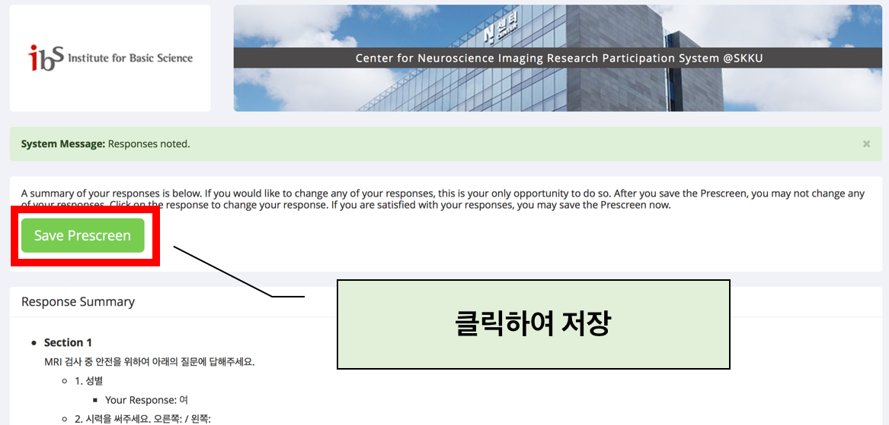
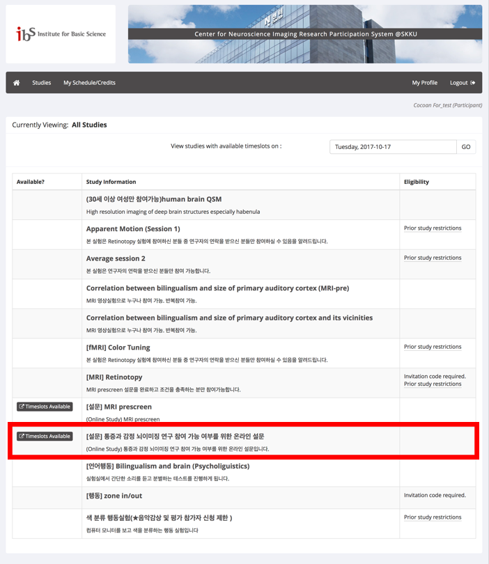
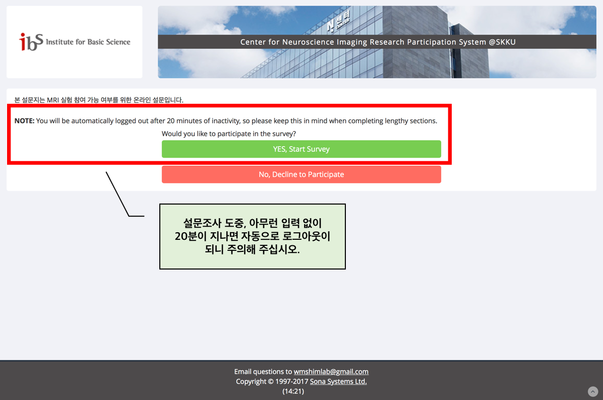

 
## 1. https://goo.gl/qaStf1 에서 회원가입 및 로그인

 

## 2. 회원가입 방법

 

## 3.  Prescreen 설문에 참여하기

### (계속)

### (계속)

 

## 4.  Available studies에서 <통증과 감정 뇌이미징 연구>에 참여

### (계속)

### (계속)

### (계속)

### (계속)

 

## 9. 참여 신청 완료

