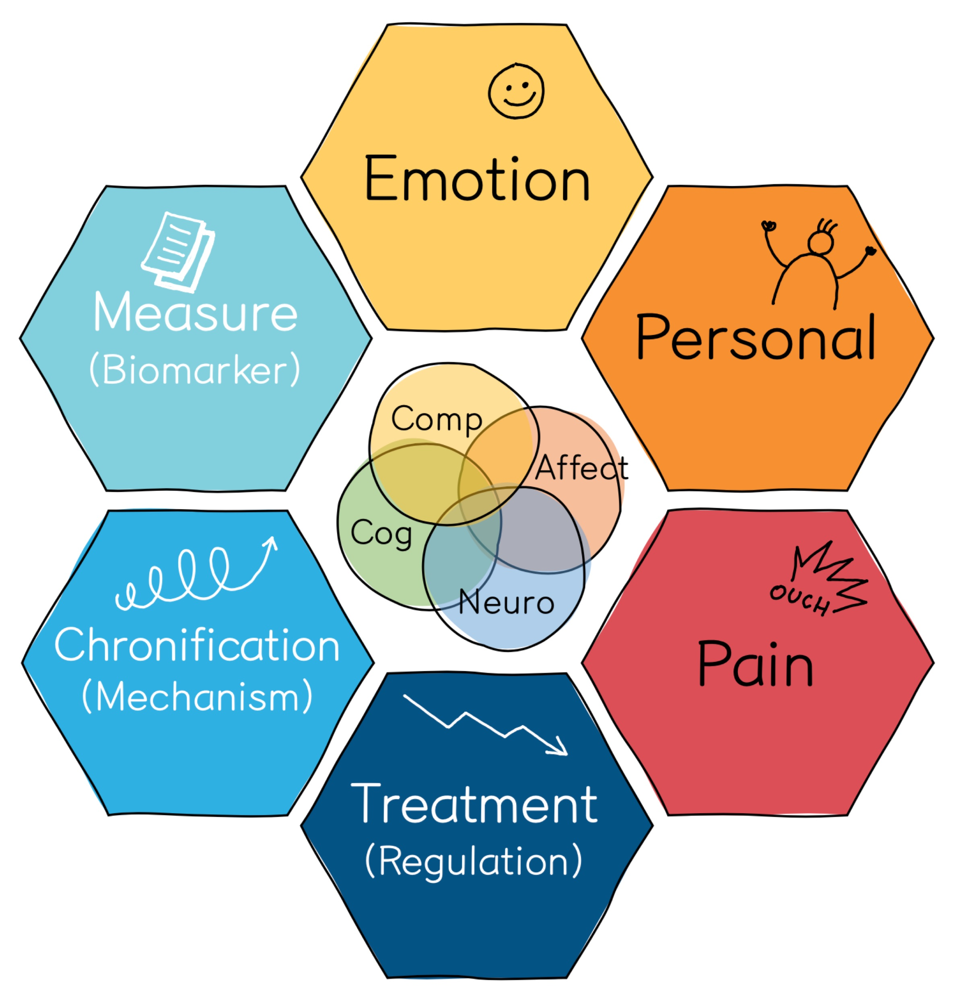

<b>Cocoan lab</b>  is a neuroimaging research lab led by Dr. Choong-Wan Woo.  

We are joining the <a href="https://www.ibs.re.kr">IBS</a> <a href="http://cnir.ibs.re.kr/html/cnir_en/">Center for Neuroscience Imaging Research (CNIR)</a> at <a href="http://www.skku.edu/eng_home/index.jsp">Sungkyunkwan University</a> (<a href="https://en.wikipedia.org/wiki/Sungkyunkwan_University">Wikipedia</a>) located in Suwon, South Korea (starting March 2017). 

The **keywords** of our research include:  
fMRI; Machine learning; Neuroimaging biomarkers; Data science; Translational research; Predictive modeling; Brain decoding, Encoding-decoding model; Pain; Emotions; Psychiatric and neurologic disorders; Mind-body interaction; Behavioral medicine; Network science; Psychological and social pain modulation; Emotion regulation, and more.

The mission of our lab is to understand pain and emotions in the perspective of data science, cognitive/affective/social neuroscience, and psychology. We also aim to develop clinically useful neuroimaging models and tools that can be used and shared across different research groups and clinical settings. 

Our main research tools include functional Magnetic Resonance Imaging (fMRI; we're using 3T and 7T MRI), psychophysiology measures (skin conductance, pupilometry, electrocardiogram, respiration), electroencephalogram (EEG), and other behavioral measures such as facial expression, eye movement, etc. Most importantly, we use data science (computational) tools to model and understand affective, cognitive, and behavioral responses.  

 

<iframe width="560" height="315" src="https://www.youtube.com/embed/NqMFXK-A7dU" frameborder="0" allow="accelerometer; autoplay; encrypted-media; gyroscope; picture-in-picture" allowfullscreen></iframe>

 
[We are always looking for talented and enthusiastic people for the lab!](/jobs/)

- Current openings: 
	- 1 or 2 undergraduate research assistant (학부연구생; 학부연구생이면서 파트타임으로 연구를 도울 수 있는 분도 찾고 있습니다)
	- 1 or 2 graduate students (for AY 2021)
	- Feel free to email Wani to ask about job openings in the lab.

If you are interested in participating our experiments, [please visit here.](/research/participation)

 

<u>Cocoan Lab Research Diagram</u>

