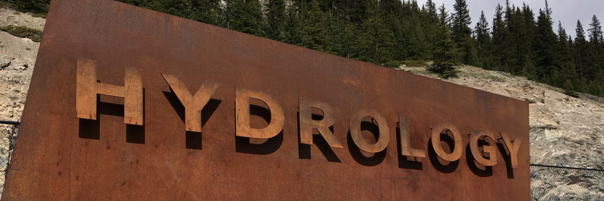

<b>Welcome! </b>  I am a hydrologist who focuses on accurate and timely estimations and predictions of critical hydrologic fluxes, storages, and processes for enhanced water resources management, flood prediction, and infrastructure design. For this, I use field observations, multiple remote sensing techniques (active and passive microwave, infrared, thermal, and gamma radiation) via UAV, aircraft, and satellite platforms, and climate and hydrological model simulations along with big-data analytics. 
I am currently an Assistant Professor at <a href="https://www.txst.edu/">Texas State University</a>, San Marcos, TX, starting in Fall 2023. Prior to this, I was a Postdoctoral/Assistant Research Scientist at <a href="https://science.gsfc.nasa.gov/earth/hydrology/">Hydrological Sciences Laboratory</a>, <b>NASA Goddard Space Flight Center</b> & <a href="http://essic.umd.edu/joom2/">Earth System Science Interdisciplinary Center</a>, <b>University of Maryland at College Park</b>. I also worked with Dr. Jennifer Jacobs at University of New Hampshire, where I obtained a Ph.D. in Civil and Environmental Engineering in May 2020.   

<b> NASA | Earth's Water Cycle </b>
 

<iframe width="560" height="315" src="https://youtu.be/oaDkph9yQBs?si=MDmkGUu6tNR1oomK" frameborder="0" allow="accelerometer; autoplay; encrypted-media; gyroscope; picture-in-picture" allowfullscreen></iframe>

 

