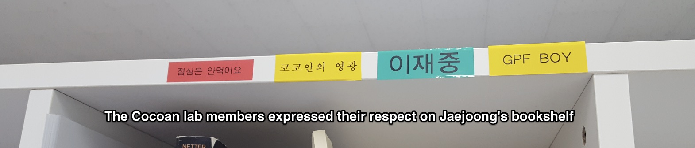
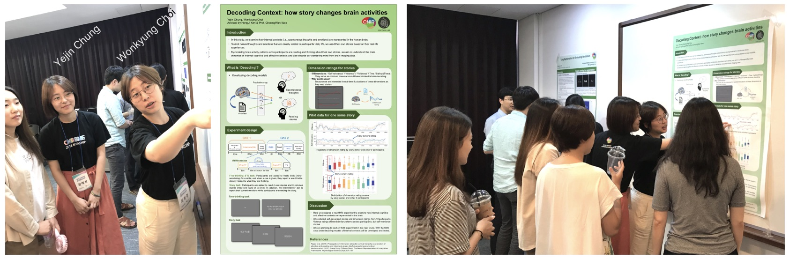
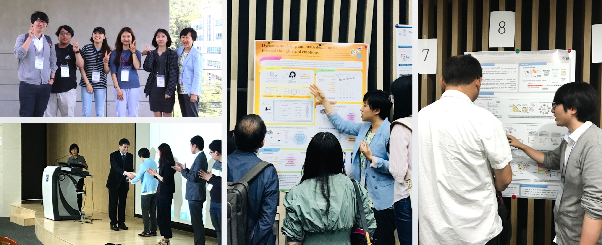
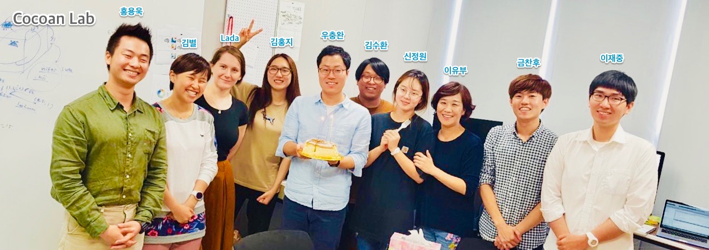
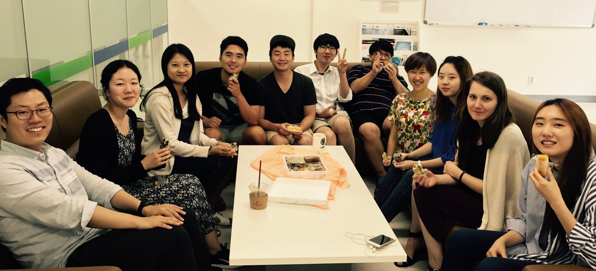
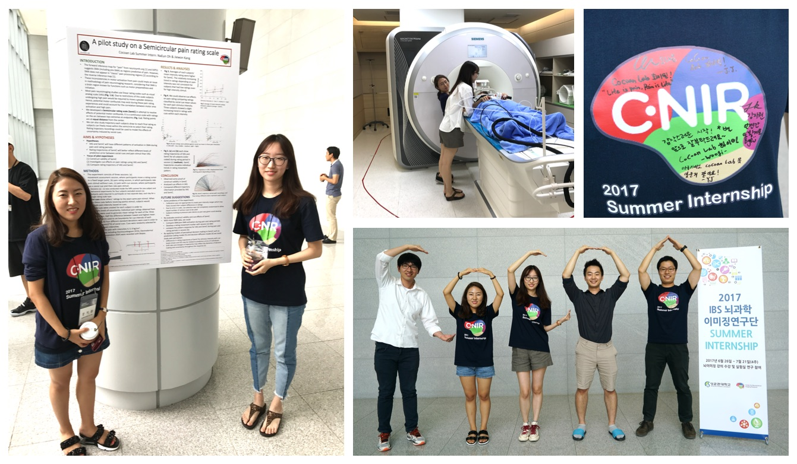

Aug 2018 

<b>Jaejoong Lee is selected to receive the Global PhD Fellowship (GPF, 글로벌박사펠로우십) from Korean National Research Foundation.</b>

Congratulations, Jaejoong! The GPF is  highly competitive (this year, the competition rate was 5.3:1), but we knew Jaejoong would get it. :) Also great great job, Cocoanlab! All lab members helped him and worked together to make this happen. Wani said that he is so proud of Cocoanlab!

 

Jul 2018 

<b>Yejin Chung and Wonkyung Choi successfully finished 2018 CNIR summer internship program.</b>

For one-month period (6/25-7/20), Hongji (a grad student) and summer interns worked together on a very exciting new project on decoding stories based on brain activity. They almost completed experiment codes. Unfortunately, we didn't make it to fMRI data analysis. Yejin and Wonkyung, please come back to the lab if you'd like to continue the fMRI experiments and analyses you've started here. :)

 

<b>A paper titled "Cognitive self-regulation influences pain-related physiology" was posted on bioRxiv</b>

You can see the paper <a href="https://www.biorxiv.org/content/early/2018/07/04/361519">here</a>, and I wrote some background story about the paper on <a href="https://twitter.com/choongwanwoo/status/1015173555984654337">twitter</a>.

 

<b>A paper titled "False-positive neuroimaging: Undisclosed flexibility in testing anatomical region-based hypotheses allows presenting anything as a replicated finding" (first author: Yongwook) has been submitted and now is under review</b>

 

Jun 2018 

<b>Jaejoong and Byeol gave poster presentations at the annual meeting of the Korean Society for Cognitive Science, and Byeol received a Best Presentation Award. Congrats!</b>

(Left top) Jaejoong, Suhwan, Hongji, Sooan, Jinwon, and Byeol. See Byeol's face expression. She seems happy for the award. (Left bottom) Byeol is receiving the award. (middle) Byeol is presenting her work. (Right) Jaejoong is explaining his work to Dr. Yuki Kamitani (he was a plenary speaker of the conference). 

 

<b>Sangeun Yeom joined the Cocoan lab!</b>

Check out her research interests and brief introduction [here](/people/).

 

Mar 2018 

<b>Jin Oh joined the Cocoan lab!</b>

Check out her research interests and brief introduction [here](/people/).

 

Feb 2018 

<b>Seong Jae Park joined the Cocoan lab!</b>

Check out his research interests and brief introduction [here](/people/).

 

Jan 2018 

<b>A paper on "Generalizable representations of pain, cognitive control, and negative emotion in medial frontal cortex" is in press on <i>Nature Neuroscience</i></b>

Phil Kragel (a postdoc in Tor Wager's lab) is the first author of the [paper](/publication/#NN_Kragel2018). Wani contributed to this study by sharing our recent fMRI data. Wani <i>knew</i> that this paper will become big from the beginning! :) Wani was so happy and appreciate to be a part of this study. Thanks, Phil. You did a great job! 

 

Dec 2017 

<b>Jinwon Park joined the Cocoan lab!</b>

Check out her research interests and brief introduction [here](/people/).

 

Sep 2017 

<b>Happy lab!</b>

 

Sep 2017 

<b>Myeonghun Beak, Taenyun Kim, Yelin Lee and Minie Jung joined the Cocoan lab!</b>

Check out their research interests and brief introduction [here](/people/).

 

Aug 2017 

<b>Lada Kohoutová, Catherine Cho, Byeol Kim and Suhwan Gim joined the Cocoan lab!</b>

Check out their research interests and brief introduction [here](/people/).

 

July 2017 

<b>NaEun Oh and Jiewon Kang successfully finished 2017 CNIR summer internship program.</b>

 

June 2017 

<b>Hong Ji Kim, Yejong Yoo, Sooan Lee, Jeongwon Shin, and Chanhoo Kum joined the lab as undergrad research assistants.</b>

Check out their research interests and brief introduction [here](/people/).

 

May 2017 

<b>Jongyun Jeong joined the lab as undergrad research assistants.</b>

Check out his research interest and brief introduction [here](/people/).

 

March 2017 

<b>A new paper on placebo effects on painful emotions due to social rejection has been published on <i>Journal of Neuroscience</i>. </b>

Here is the <a href="/pdfs/Koban_2017_JN.pdf">PDF</a> of the paper.

 

<b>Yongwook Hong and Jaejoong Lee joined the lab. </b>

Check out their research interest and brief introduction [here](/people/).

 

<b>Our paper on building better neuroimaging biomarkers has been published on <i>Nature Neuroscience</i>. </b>

This <a href="/pdfs/Woo_2017_NatNeuro.pdf">paper</a> contains important ideas about what translational neuroimaging research would look like in the future. Also if you're interested in joining the lab, you would be able to learn what our near-future research direction could be from this paper.

 

<b>We are joining the IBS Center for Neuroscience Imaging Research (CNIR) at Sungkyunkwan University. </b>

 Starting March 2017, we are joining the <a href="https://www.ibs.re.kr">IBS</a> <a href="http://cnir.ibs.re.kr/html/cnir_en/">Center for Neuroscience Imaging Research</a> and <a href="http://www.skku.edu/eng_home/index.jsp">Sungkyunkwan University</a>. Our lab will be located in Suwon, which is near Seoul in South Korea, and more specifically the <a href="https://www.google.com/maps/place/성균관대학교+자연과학캠퍼스/@37.2933069,126.9756129,3a,75y,185.03h,87.96t/data=!3m8!1e1!3m6!1s-QurvzUlLyfM%2FV6-taG4WiVI%2FAAAAAAAAACc%2F6TUAFkNNYlcsLNVOMNF4yr9bz41wz3d2ACJkC!2e4!3e11!6s%2F%2Flh6.googleusercontent.com%2F-QurvzUlLyfM%2FV6-taG4WiVI%2FAAAAAAAAACc%2F6TUAFkNNYlcsLNVOMNF4yr9bz41wz3d2ACJkC%2Fw203-h100-k-no-pi-0-ya160.43434-ro-0-fo100%2F!7i8704!8i4352!4m5!3m4!1s0x357b42b036588595:0xee747d46c57fc8a4!8m2!3d37.2939168!4d126.9753993!6m1!1e1">N-center</a> at Sungkyunkwan University. We are planning to hire some people (postdoc and lab manager) for the lab. If you are interested in joining the lab, you can find some relevant information [here](/jobs/).

 
February 2017 

<b>Our paper on developing predictive models for pain using multi-study fMRI data is published on <i>Nature Communications</i>.</b>

 It's finally <a href="http://www.nature.com/articles/ncomms14211">online</a> (<a href="/pdfs/Woo_2017_NCOMMS.pdf">pdf</a>; see [Publication](/publication/) for more links). In this new paper, we identified a new fMRI pattern that is predictive of pain above and beyond stimulus intensity and nociceptive brain response. Tor and I had this analysis idea since my second year of the graduate school, and I did the first version of this study as a final project for Tor's fMRI method class. Thanks to our lab's collaborative efforts to create the large-scale single-trial pain dataset, I was able to scale up the study, and the final version of the study ended up including data from six different pain studies (_N_ = 183). This was one of the main reasons that our paper was able to be published on _Nature Communications_. The pattern we identified explained variation in trial-by-trial pain ratings not captured by a previous fMRI-based marker for nociceptive pain (i.e., <a href="../pdfs/Wager_2013_NEJM.pdf">Neurologic Pain Signature</a>). In addition, the new pattern mediated the pain-modulating effects of three psychological manipulations of expectations and perceived control. We hope that the new pattern signature provides a generalizable and extensible characterization of cerebral contributions to pain and specific brain targets for interventions. 
