

<b>Lab director</b>

<b>Choong-Wan Woo</b>

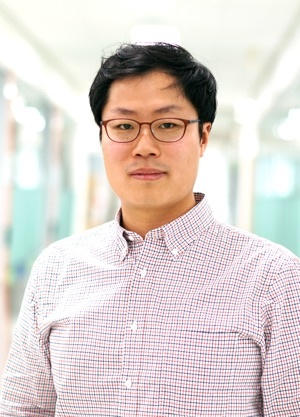
Choong-Wan (Wani) is the director of the Cocoan lab. His research focuses on understanding how the human brain represents, processes, and regulates pain and emotions. His recent research focuses on understanding the distinct neural mechanisms underlying different pain modulation strategies such as placebo, distraction, reappraisal, and acceptance. He received his dual PhD in the <a href="http://www.colorado.edu/psych-neuro/">Department of Psychology and Neuroscience</a> and the <a href="http://www.colorado.edu/ics/">Institute of Cognitive Sciences</a> from the University of Colorado Boulder (PhD advisor: <a href="http://wagerlab.colorado.edu/">Tor D. Wager</a>), and MA in Clinical psychology and BS in Biology from Seoul National University. He has received many awards including the <a href="http://www.iie.org/fulbright">Fulbright Graduate Study Award</a> from Korea and US governments, the Carol B. Lynch Graduate Fellowship from the graduate school of the University of Colorado Boulder, and the Heyer Award from the Department of Psychology and Neuroscience. Currently, he is an assistant professor at the IBS Center for Neuroscience Imaging Research and the Department of Biomedical Engineering in the Sungkyunkwan University (SKKU). 

<a href="/pdfs/CV_Woo_Apr2017.pdf">CV</a> | <a href="https://scholar.google.com/citations?user=fZLY5H8AAAAJ&hl=en&oi=ao">Google Scholar</a> | <a href="https://github.com/wanirepo/">Github</a> | <a href="https://twitter.com/choongwanwoo/">Twitter</a>

 
<b>Postdoctoral Fellow</b>

<b>Catherine Cho</b>

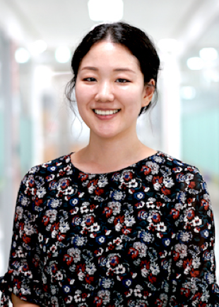
Catherine is a postdoc in the Cocoan lab. She is currently interested in identifying neural markers associated with affective and cognitive constructs and developing a framework for psychological components. More broadly, she is interested in how people’s affective processing influences decision making, and the ways in which people regulate their emotions and stress. She received her Ph.D. in Psychology from Rutgers University-Newark (advisor: Mauricio Delgado), where her dissertation work focused on the effects of perceived controllability on decision making and affective processing. She also graduated from the Psychology program at Smith College (B.A.) and the Educational Psychology program from Korea University (M.A.) (advisors: Sung-il Kim and Mimi Bong).

<a href="/pdfs/CV_Cho_201708.pdf">CV</a> | <a href="https://twitter.com/natural_cc/">Twitter</a>

 

<b>Graduate students</b>

<b>Jae-joong Lee</b>

Jae-joong is a graduate student in the Cocoan lab. He received IBS director's fellowship, which allowed him to do a lab rotation during his first-year graduate study. After a few-month search, he finally chose to join the Cocoan lab!! He is interested in developing fMRI-based biomarkers for basic neural processes, and ultimately wants to find building blocks of psychiatric diseases. He is currently working on a project developing pain predictive models based on fMRI dynamic connectivity patterns. He recevied his M.D. in Hanyang University.

   

<b>YongWook Hong</b>

YongWook is a graduate student in the Cocoan lab. He received B.A. in psychology at Taylor University.  He is interested in the mind-body-brain interactions and wants to study the relationships between pain and its psychology aspects. He is also passionate about projects that will improve people’s physical and psychological well-being. He is currently working on a project highlighting an important methodological issue related to replicability crisis in human fMRI neuroimaging studies. 

    

<b>Byeol Kim</b>

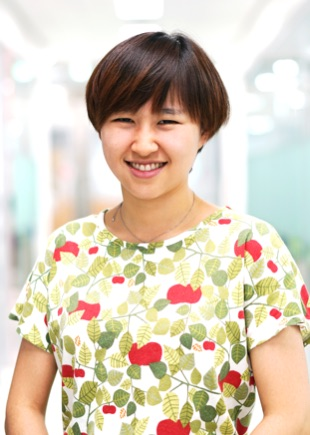
Byeol joined the Cocoan lab as a graduate student since the 2017 summer. She majored in astronomy and psychology at Yonsei University. She is interested in the neural mechanisms underlying the effects of social contexts and factors on subjective pain. She is currently working on a project developing computational models for the dynamics of internal thoughts. 

    

<b>Suhwan Gim</b>

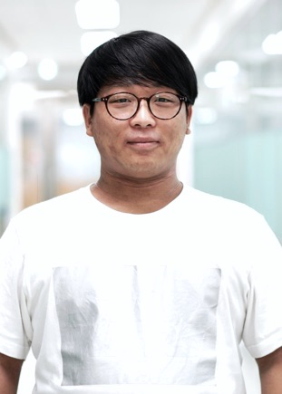
Suhwan is currently a lab manager of the Cocoan lab (but will start his PhD in the lab beginning March 2018). He received B.A. in psychology at Sungkyunkwan University. His research interest is to understand how psychological health and biological factors influence each other. He is eager to answer the question of how the environment (e.g., personal background, contexts, cultures, etc.) affects subjective experience of pain and its brain activity.

    

<b>Hong Ji Kim</b>

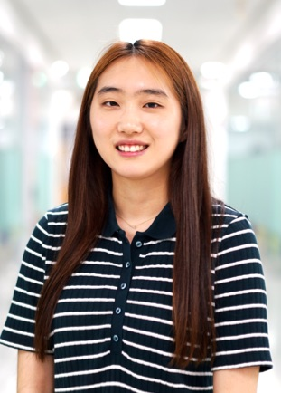
Hong Ji will start her PhD in the Cocoan lab beginning March 2018. During undergrad, she double-majored in Biological science and Psychology. She is currently interested in understanding the links between neuroscience and social psychology, especially human motivation such as belonging motivation, self, intrinsic motivation, and regulatory fit. Understanding differences in neural representations of different types of pain--e.g., psychological, social, and physical--is also her interest.

      

<b>Research staffs</b>

<b>Lada Kohoutová</b>

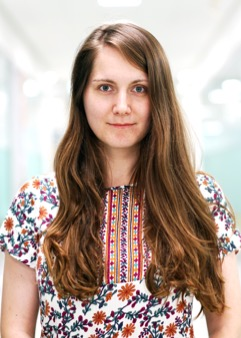
Lada is a post-master researcher in the Cocoan lab. She received her BS and MS in electrical engineering from Czech Technical University. Her research interests include computational methods in neuroscience and their application in biomarker development. She is currently working on a project aimed to enhance interpretability of computational models in neuroimaging.

      

<b>Undergraduate students</b>

<b>Sooan Lee</b>

Sooan is an undergrad research assistant in the Cocoan Lab. Her major is Psychology, and she is interested particularly in positive psychology. She wants to study psychological mechanisms and methods to enhance people's mental health and well-being.

     

<b>Yelin Lee</b>

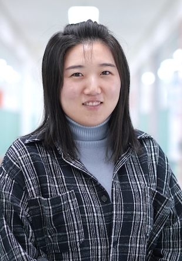
Yelin is an undergrad research assistant in the Cocoan lab. She is majoring in molecular biology at Dankook University. She wants to study human psychology using scientific methods. Her goal is to help patients through the understanding of brain mechanisms of cognitive and affective processes 

     

<b>Minie Jung</b>

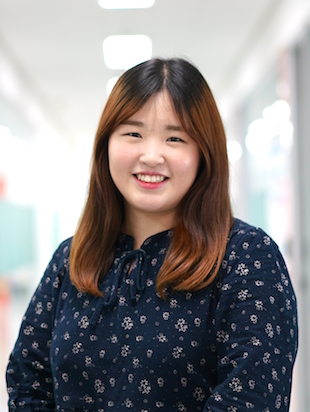
Minie is an undergrad research assistant in the Cocoan lab. She is double majoring in Genetic engineering and Convergence software (Samsung Convergence Software Course, SCSC) as Sungkyunkwan University. She is interested in studying a behavioral neuroscience, particularly treatments for mental illnesses. She also interested in applying computational methods to neuroscience. 

    

<b>Taenyun Kim</b>

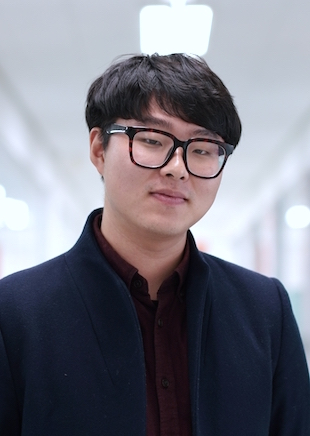
Taenyun is an undergrad research assistant in the Cocoan lab. He is majoring in Psychology at Sungkyunkwan University. He is interested in human decision-making processes and social cognition, and their neural basis. He also wants to know about the interference of pains when persons make choices. His goal is to identify the mechanisms of human decision-making processes and find the way to improve them for better outcomes. 

    

<b>JeongWon Shin</b>

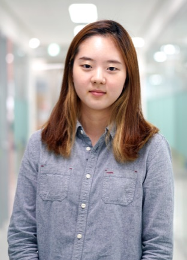
Jeongwon is an undergrad research assistant in the Cocoan lab. She is passionate about studying Psychology and Neuroscience. She wants to understand individuals' psychological contexts by examining their brain activity. She is also interested in developing methods to make a "mentally-healthy" society. 

    

<b>Chanhoo Kum</b>

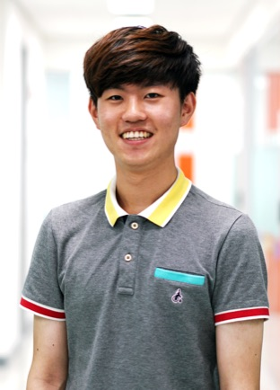
Chanhoo is an undergrad research assistant in the Cocoan lab. He majors in Biomedical Engineering at Sungkyunkwan University. He is intererested in Neuroscience, especially decoding sensory imagination. He is currently assisting a research on developing a new pain rating scale. 

    

<b>Myeonghun Beak</b>

Myeonghun is an undergrad research assistant in the Cocoan lab. He is majoring in medicine and minoring in cognitive science at Gachon University. He is interested in clinical applications(e.g., diagnosis, prevention, treatment, etc.) of computational methodologies for neurological diseases, especially related to cognitive dysfunctions and impairments. He is currently assisting on a project aimed to identify neural patterns and dynamics of self-generated thoughts. 

    

<b>Jinwon Park</b>

Jinwon is an undergrad research assistant in the Cocoan Lab. Her major is Psychology. She wants to explore the physical and mental functions of human beings, combine them with clinical psychology, and understand pain and emotion. 

      

<b>Collaborators</b>

Within CNIR
 

<li>Dr. Yubu Lee, Research professor: Affective computing, fMRI data analysis, facial expression analyses</li>

<li>Dr. Eunha Baeg, Research professor: Nonhuman primate fMRI</li>

 
Within SKKU
 

<li>Sungmin Cha (PhD student) and Taesup Moon (Professor at Electronic and Electrical Engineering, SKKU, <a href="http://mind.skku.edu">M.IN.D. lab</a>): Developing fMRI-based pain markers using deep-learning algorithms (named Deep Pain Project)</li>

<li>Bo-yong Park (PhD student) and Hyunjin Park (Professor at Electronic and Electrical Engineering, SKKU, <a href="https://www.sites.google.com/site/medicalimageprocessinglab/home">MIP lab</a>): Projects using open-source, large-scale data (named Big Pain Project)</li>

 
International
 

<li>Tor Wager et al. (My PhD advisor, University of Colorado Boulder, <a href="http://canlabweb.colorado.edu/">CAN lab</a>): Various projects</li>

<li>Alex Shackman (University of Maryland, <a href="http://shackmanlab.org">Shackman lab</a>): Cognitive control, negative emotion, and pain in aMCC</li>

<li>Pierre Rainville et al. (Universitaire de Montréal, <a href="http://rainville.criugm.qc.ca/wordpress/?page_id=52&lang=en">LaNeP3</a>): After-effect of cognitive control on pain</li>

<li>Jessica Andrews-Hanna (University of Arizona, <a href="http://www.u.arizona.edu/~jandrewshanna/Jessica_Andrews-Hanna/Home.html">NET lab</a>): Free-association semantic task </li>

    

<b>Alumni</b>

<b>Jongyun Jeong</b>

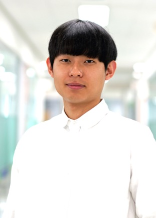
Jongyun was an undergrad research assistant in the Cocoan lab. He is an undergrad student at Sungkyunkwan University. He majors in Biology and Convergence Software (Samsung Convergence Software Course, SCSC). He left the lab to finish his mandatory military service. We hope to see him again after his military service!

     

<b>Yejong Yoo</b>

Yejong was an undergrad research assistant in the Cocoan lab. He is studying Biology at Taylor University. His research interest involves exploring objective biological markers for both nociceptive and comprehensive pain and finding a way to apply the biological markers to diagnose the sources of the pain and quantitatively measure the various pains. He went back to the US to continue his study at Taylor University. We hope to see him again next summer!

     

<b>2017 undergrad summer interns (CNIR Summer internship program)</b>

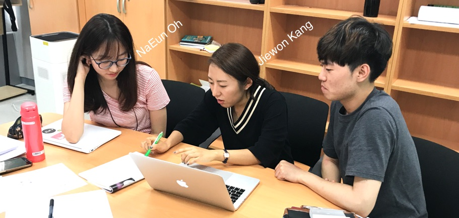

NaEun Oh, Psychology, Sogang University 
 
Jiewon Kang, Biomedical Engineering, King's College London (currently at Imperial College London) 

      

<b>We're hiring!</b> (for more imforation, please see [here](/jobs/))

<!--       

## Past Members

### University at Buffalo
<ul>
	<li><a href="https://longshengsun.net" target="_blank">Longsheng Sun</a>, Ph.D., 2016, Designing Regulation Policies for Hazardous Materials Transportation</li>
	<li><a href="https://www.linkedin.com/pub/masoumeh-taslimi/92/b90/b33" target="_blank">Masoumeh Taslimi</a>, Ph.D., 2015, On the Analysis of Two Problems related to Risk Management in Urban Transportation Networks</li>
	<li><a href="https://www.linkedin.com/in/tolou-esfandeh-phd-b179b237" target="_blank">Tolou Esfandeh</a>, Ph.D., 2015, Regulating Hazardous Materials Transportation by Dual-Toll Pricing and Time-Dependent Network Design Policies</li>
	<li><a href="https://www.linkedin.com/pub/iakovos-toumazis/49/327/917" target="_blank">Iakovos Toumazis</a>, Ph.D., 2015, Dynamic Chemotherapy Scheduling for Metastatic Colorectal Cancer Patients: Assessments and Improvements (<a href="http://toumiak.com" target="_blank">web</a>)</li>
	<li><a href="https://www.linkedin.com/profile/view?id=61312329" target="_blank">Md. Tanveer Ahmed</a>, Ph.D., 2013, Revenue Management for Online Advertisement Services</li>
	<li><a href="https://www.linkedin.com/profile/view?id=355659138">Paul Berglund</a>, Ph.D., 2012 Three Problems in Discrete Network Facility Location</li>
	<li><a href="https://www.linkedin.com/profile/view?id=67693217">Yingying Kang</a>, Ph.D., 2011, (co-advisor Dr. Rajan Batta), Value-at-Risk Models for Hazardous Materials Transportation</li>
	<li><a href="https://www.linkedin.com/in/alisattarzadeh" target="_blank">Ali Sattarzadeh</a>, M.S., 2015, Hazmat Network Design Considering Risk and Cost Equity</li>
	<li><a href="https://www.linkedin.com/profile/view?id=82661512" target="_blank">Zulqarnain Haider</a>, M.S., 2014, Inventory Rebalancing through Pricing in Public Bike Sharing Systems</li>
	<li><a href="https://www.linkedin.com/profile/view?id=109106725" target="_blank">Chelsea Greene</a>, M.S., 2013 (co-advisor Dr. Rajan Batta), OR/MS Approaches to Problems involving Hazardous Materials Risk and Impacts from a Natural Disaster</li>
	<li><a href="https://www.linkedin.com/profile/view?id=29510416" target="_blank">Anand Srinivasan</a>, M.S., 2010, Operations of Online Advertising Services and Publisher's Options</li>
	<li><a href="https://www.linkedin.com/profile/view?id=46544652" target="_blank">Amod Anand Agashe</a>, M.S., 2010, Stochastic Revenue Optimization in Online Advertising</li>
	<li><a href="https://www.linkedin.com/profile/view?id=46856185" target="_blank">Varun Narayana Kutty</a>, M.S., 2010, Accept-Reject Decision in Online Advertising using Geometric Brownian Motion</li>
</ul>

&nbsp;-->
