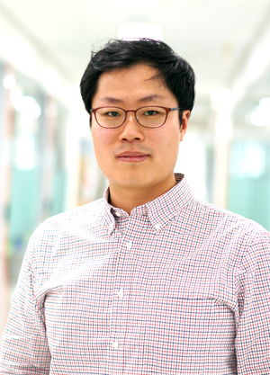
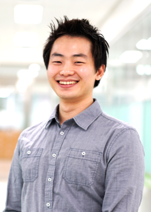
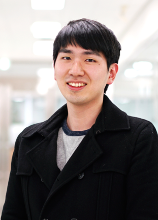

<b>Lab director</b>

<b>Choong-Wan Woo</b>

Choong-Wan (Wani) is the director of the Cocoan lab. His research focuses on understanding how the human brain represents, processes, and regulates pain and emotions. His recent publications span the topics from developing neuroimaging-based markers for pain to how to build better biomarkers in translational neuroimaging. His recent research focuses on understanding the distinct neural mechanisms underlying different pain modulation strategies such as placebo, distraction, reappraisal, and acceptance. He received his dual PhD in the <a href="http://www.colorado.edu/psych-neuro/">Department of Psychology and Neuroscience</a> and the <a href="http://www.colorado.edu/ics/">Institute of Cognitive Sciences</a> from the University of Colorado Boulder (PhD advisor: <a href="http://wagerlab.colorado.edu/">Tor D. Wager</a>), and MA in Clinical psychology and BS in Biology from Seoul National University. He has received many awards including the <a href="http://www.iie.org/fulbright">Fulbright Graduate Study Award</a> from Korea and US governments, the Carol B. Lynch Graduate Fellowship from the graduate school of the University of Colorado Boulder, and the Heyer Award from the Department of Psychology and Neuroscience. Currently, he is an assistant professor at the IBS Center for Neuroscience Imaging Research and the Department of Biomedical Engineering in the Sungkyunkwan University (SKKU). 

<a href="/pdfs/CV_Woo_Apr2017.pdf">CV</a> | <a href="https://scholar.google.com/citations?user=fZLY5H8AAAAJ&hl=en&oi=ao">Google Scholar</a> | <a href="https://github.com/wanirepo/">Github</a> | <a href="https://twitter.com/choongwanwoo/">Twitter</a>

 

<b>Graduate students</b>

<b>YongWook Hong</b>

YongWook is a research assistant (lab manager) of the Cocoan lab. He received B.A. in psychology at Taylor University.  He is currently interested in the mind-body-brain interaction and wants to study the relationships between pain and its psychology. He is passionate about projects that will improve people’s physical and psychological well-being. 

     

<b>Jae-joong Lee</b>

Jae-joong is a graduate student at Sungkyunkwan University. He received IBS director's fellowship, which allows him to rotate multiple labs at IBS during his first-year graduate study. He is currently doing a lab rotation in the cocoan lab and the IBS director's lab. He is interested in investigating objective markers for basic neural processes, and ultimately wants to find building blocks of psychiatric diseases especially of pain or emotions. He recevied his M.D. in Hanyang University.

   

<b>Undergraduate students</b>

<b>Jongyun Jeong</b>

Jongyun is an undergrad research assistant in the Cocoan lab. He is an undergrad student at Sungkyunkwan University. He majors in Biology and Convergence Software (Samsung Convergence Software Course, SCSC). He is interested in understanding the neural mechanisms of emotion regulation using computational tools. He is also eager to develop computational tools for neuroscience research.

   

<b>Hong Ji Kim</b>

Hong Ji is an undergrad research assistant in the Cocoan lab. She is double majoring in Biological science and Psychology. She is currently interested in understanding the links between neuroscience and social psychology, especially human motivation such as belonging motivation, self, intrinsic motivation, and regulatory fit. Understanding differences in neural representations of different types of pain--e.g., psychological, social, and physical--is also her interest.

   

<b>Yejong Yoo</b>

Yejong is an undergrad research assistant in the Cocoan lab. He is studying Biology at Taylor University. His research interest involves exploring objective biological markers for both nociceptive and comprehensive pain and finding a way to apply the biological markers to diagnose the sources of the pain and quantitatively measure the various pains.

   

<b>Sooan Lee</b>

Sooan is an undergrad research assistant in the Cocoan Lab. Her major is Psychology, and she is interested particularly in positive psychology. She wants to study psychological mechanisms and methods to enhance people's mental health and well-being.

    

<b>JeongWon Shin</b>

Jeongwon is an undergrad research assistant in the Cocoan lab. She is passionate about studying Psychology and Neuroscience. She wants to understand individuals' psychological contexts by examining their brain activity. She is also interested in developing methods to make a "mentally-healthy" society. 

   

<b>Collaborators</b>

&nbsp;&nbsp;&nbsp; Dr. Yubu Lee, Research professor (affective computing, facial expression analyses) 
&nbsp;&nbsp;&nbsp; Dr. Eunha Baeg, Research professor (nonhuman primate fMRI) 

    

<b>We're hiring!</b> (for more imforation, please see [here](/jobs/))

<!--       

## Past Members

### University at Buffalo
<ul>
	<li><a href="https://longshengsun.net" target="_blank">Longsheng Sun</a>, Ph.D., 2016, Designing Regulation Policies for Hazardous Materials Transportation</li>
	<li><a href="https://www.linkedin.com/pub/masoumeh-taslimi/92/b90/b33" target="_blank">Masoumeh Taslimi</a>, Ph.D., 2015, On the Analysis of Two Problems related to Risk Management in Urban Transportation Networks</li>
	<li><a href="https://www.linkedin.com/in/tolou-esfandeh-phd-b179b237" target="_blank">Tolou Esfandeh</a>, Ph.D., 2015, Regulating Hazardous Materials Transportation by Dual-Toll Pricing and Time-Dependent Network Design Policies</li>
	<li><a href="https://www.linkedin.com/pub/iakovos-toumazis/49/327/917" target="_blank">Iakovos Toumazis</a>, Ph.D., 2015, Dynamic Chemotherapy Scheduling for Metastatic Colorectal Cancer Patients: Assessments and Improvements (<a href="http://toumiak.com" target="_blank">web</a>)</li>
	<li><a href="https://www.linkedin.com/profile/view?id=61312329" target="_blank">Md. Tanveer Ahmed</a>, Ph.D., 2013, Revenue Management for Online Advertisement Services</li>
	<li><a href="https://www.linkedin.com/profile/view?id=355659138">Paul Berglund</a>, Ph.D., 2012 Three Problems in Discrete Network Facility Location</li>
	<li><a href="https://www.linkedin.com/profile/view?id=67693217">Yingying Kang</a>, Ph.D., 2011, (co-advisor Dr. Rajan Batta), Value-at-Risk Models for Hazardous Materials Transportation</li>
	<li><a href="https://www.linkedin.com/in/alisattarzadeh" target="_blank">Ali Sattarzadeh</a>, M.S., 2015, Hazmat Network Design Considering Risk and Cost Equity</li>
	<li><a href="https://www.linkedin.com/profile/view?id=82661512" target="_blank">Zulqarnain Haider</a>, M.S., 2014, Inventory Rebalancing through Pricing in Public Bike Sharing Systems</li>
	<li><a href="https://www.linkedin.com/profile/view?id=109106725" target="_blank">Chelsea Greene</a>, M.S., 2013 (co-advisor Dr. Rajan Batta), OR/MS Approaches to Problems involving Hazardous Materials Risk and Impacts from a Natural Disaster</li>
	<li><a href="https://www.linkedin.com/profile/view?id=29510416" target="_blank">Anand Srinivasan</a>, M.S., 2010, Operations of Online Advertising Services and Publisher's Options</li>
	<li><a href="https://www.linkedin.com/profile/view?id=46544652" target="_blank">Amod Anand Agashe</a>, M.S., 2010, Stochastic Revenue Optimization in Online Advertising</li>
	<li><a href="https://www.linkedin.com/profile/view?id=46856185" target="_blank">Varun Narayana Kutty</a>, M.S., 2010, Accept-Reject Decision in Online Advertising using Geometric Brownian Motion</li>
</ul>

&nbsp;-->
