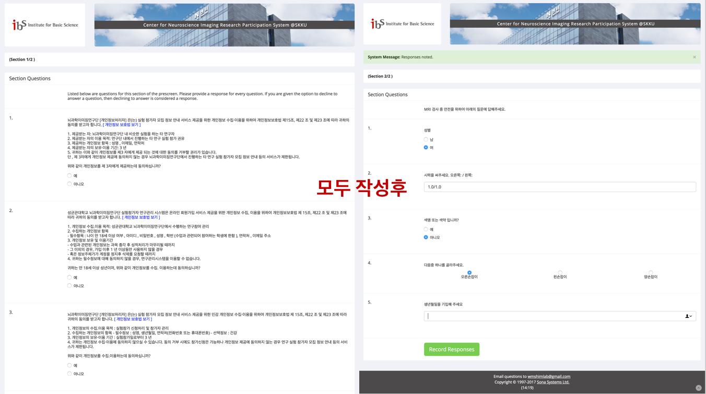
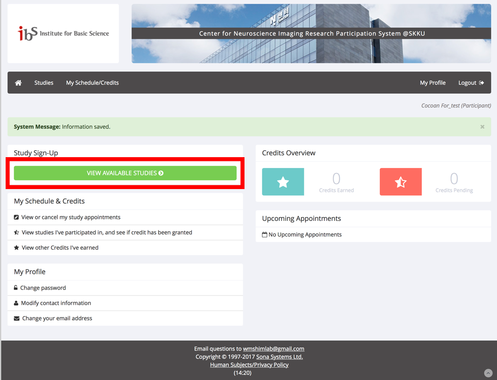

 
### 1. [https://goo.gl/qaStf1](https://goo.gl/qaStf1) 에서 회원가입 및 로그인

 

### 2. 회원가입 방법

 

### 3.  Prescreen 설문에 참여하기

#### (계속: Prescreen 설문에 참여하기)

#### (계속: Prescreen 설문에 참여하기)

 

### 4.  Available studies에서 [감정/통증 뇌이미징 연구 참여 가능 여부를 위한 온라인 설문]에 참여

#### (계속: Available studies에서 [감정/통증 뇌이미징 연구 참여 가능 여부를 위한 온라인 설문]에 참여)

#### (계속: Available studies에서 [감정/통증 뇌이미징 연구 참여 가능 여부를 위한 온라인 설문]에 참여)

#### (계속: Available studies에서 [감정/통증 뇌이미징 연구 참여 가능 여부를 위한 온라인 설문]에 참여)

#### (계속: Available studies에서 [감정/통증 뇌이미징 연구 참여 가능 여부를 위한 온라인 설문]에 참여)

 

### 5. 참여 신청 완료

