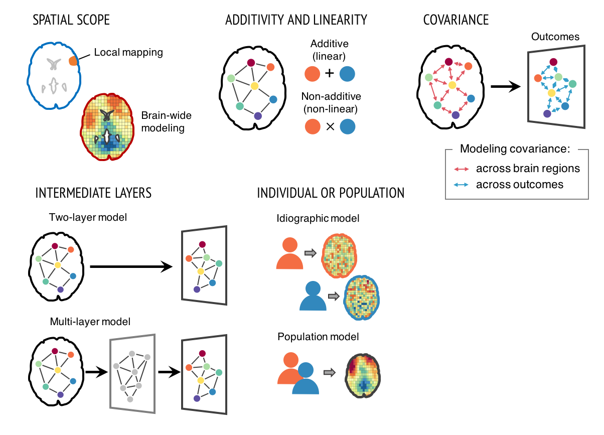
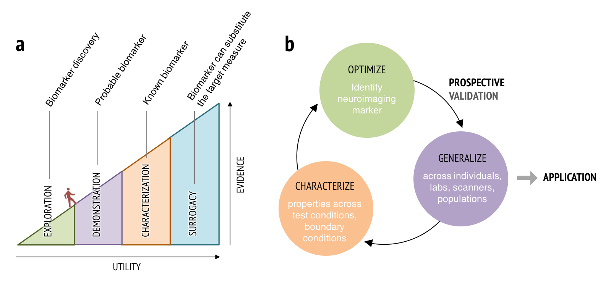

How does the brain represent, process, and regulate pain and affective experiences? The mission of our lab is basically to answer these questions to better understand pain and emotional distress, promoting the physical and psychological well-being of our family members, our friends, and our neighbors who suffer from pain and emotional distress. 

<b>Translational Neuroimaging 2.0: Developing integrated brain models of mental processes or clinical outcomes</b> 

Our research focuses on developing good neuroimaging models and markers that are predictive of mental processes and health-related outcomes. For the last two decades, neuroimaging has transformed how we study human behaviors and mental processes, but has yet to substantially impact clinical practice and public health. One important reason is that the field has focused on developing brain “maps”, not models and markers. Brain “maps” aim to identify brain regions that are associated with particular mental processes (aka 'local brain-mapping’). The goal of this approach is not to provide a complete model of symptoms or behaviors, but to test hypotheses about structure-function associations: Its focus is on whether there are any effects in one or more brain voxels or regions, rather than on whether the effects are large enough to have clinical utility. We can overcome this problem by developing integrated brain models across multiple brain regions to predict mental processes and clinical outcomes with large effect sizes. To this end, varieties of computational models can be used (<a href="#Figure 1"><b>Figure 1</b></a>). This approach might be referred to as “Translational Neuroimaging 2.0”, as it is qualitatively distinct from conventional brain mapping and has several important benefits , and this new approach can also be synergistic with recent trends of big data (the aggregation and sharing of large-scale neuroimaging datasets).

<b>Figure 1.</b> Varieties of computational modeling approaches.

Many challenges still remain to be resolved to develop useful neuroimaging biomarkers. Challenges include developing models that generalize across studies and heterogeneous populations; developing interpretable brain models; and issues related to data aggregation and quality control of multi-site studies. Computational models and big data approaches will not, in themselves, be enough to address all these challenges. Rather, brain models should be developed and validated within a systematic biomarker development framework (<a href="#Figure 2"><b>Figure 2</b></a>), treating brain models as sharable ‘research products’ (or boundary objects) that can be tested and annotated across research groups to demonstrate generalizability across samples, research contexts, and populations. This new way of thinking about neuroimaging results integrates ideas from machine learning, ‘big data,’ reproducible research, and open science to bring translational goals within reach.

<b>Figure 2. Biomarker development process. (a)</b> To be a useful neuroimaging marker, it needs to demonstrate increasing levels of supporting evidence and generalizability through multiple stages. Therefore, establishing neuroimaging markers requires a long development and validation process supported by multi-study and multi-site efforts. <b>(b)</b> Neuroimaging marker development and validation process. This process can be described as an iterative process of optimization, generalization, and characterization. 

 

<b>FMRI-based biomarkers for pain and other mental processes</b> 

In line with the new approach described above, we have been developing multiple neuroimaging biomarkers for pain. In <a href="../pdfs/Wager_2013_NEJM.pdf">Wager et al. (2013)</a> developed an fMRI pattern signature for acute pain intensity, called the Neurologic Pain Signature (NPS). The NPS has shown to be sensitive and specific to pain across a number of conditions (<a href="../pdfs/Wager_2013_NEJM.pdf">Wager et al., 2013</a>; Chang et al., 2015; <a href="../pdfs/Krishnan_2016_elife.pdf">Krishnan et al., 2016</a>; <a href="../pdfs/Woo_2015_Plos_Biol.pdf">Woo et al., 2015</a>), and generalizes to multiple types of acute pain across studies and diverse populations (<a href="../pdfs/Krishnan_2016_elife.pdf">Krishnan et al., 2016</a>; Ma et al., 2016; Brascher et al., 2016). <a href="../pdfs/LopezSola_2016_PAIN.pdf">Lopez-Sola, Woo et al. (2016)</a> found that enhanced NPS responses, combined with another fMRI signature related to non-painful sensory processing, discriminated fibromyalgia from pain-free controls with 93% accuracy, providing promising fMRI markers for fibromyalgia. More recently, Woo et al. (2017, _Nat Comms_) developed an additional fMRI pattern signature that predict pain above and beyond stimulus intensity and nociceptive pain response in the brain. We named the signature as the Stimulus Intensity Independent Pain Signature-1 (SIIPS1). The SIIPS1 is developed based on 4 training datasets (_N_ = 137) and tested on two independent test datasets (_N_ = 46). The SIIPS1 includes patterns of activity in nucleus accumbens, lateral prefrontal, parahippocampal, and other regions that are not classically considered as “pain-processing” brain regions. We also found that SIIPS1 responses mediate the pain-modulating effects of three psychological manipulations of expectations and perceived control.

These are just the beginning of developing useful fMRI biomarkers for pain and other mental processes. We are currently working on developing functional connectivity-based biomarkers for acute and chronic pain, and also aim to develop process-based predictive models. We have also developed fMRI pattern classifiers for other cognitive and affective processes, such as attentional control (Woo et al., in prep) and hurt feelings from social rejection (<a href="../pdfs/Woo_2014_NatComms.pdf">Woo et al., 2014</a>). We are also working on developing physiological markers for pain and emotions using autonomic responses (e.g., skin conductance, heart rate, respiration, etc.; Matthewson, Woo et al. in prep).

<b>Neural mechanisms of the psychological and social pain modulation</b> 

Our research also investigates the neural mechanisms of the psychological and social influences on pain (<a href="../pdfs/Woo_2015_Plos_Biol.pdf">Woo et al., 2015, _PLoS Biol_</a>; Woo et al., 2017, _Nat Comms_). Pain is more than just responding to noxious stimuli. For example, severely injured soldiers in a battle report minimal or less pain than normally expected. Conversely, chronic pain patients report intense pain with no evident physical causes. Psychological and social factors such as acceptance, attentional control, beliefs and expectations (e.g., as in placebo effects), meaning and contextual information, doctor-patient relationships, social emotions, etc. can effectively and strongly change pain experience, as used in various forms of psychotherapy for pain. Pain is also a multi-dimensional experience with sensory, cognitive, and evaluative aspects. Therefore, identifying brain systems for different aspects of pain, and understanding the neural mechanisms of the top-down influences on pain are crucial for assessing chronic pain patients and predicting which type of therapy will be effective. This line of research will eventually help accomplish my long-term research goal, establishing a foundation of the personalized medicine for patients suffering from pain and emotional distress.

